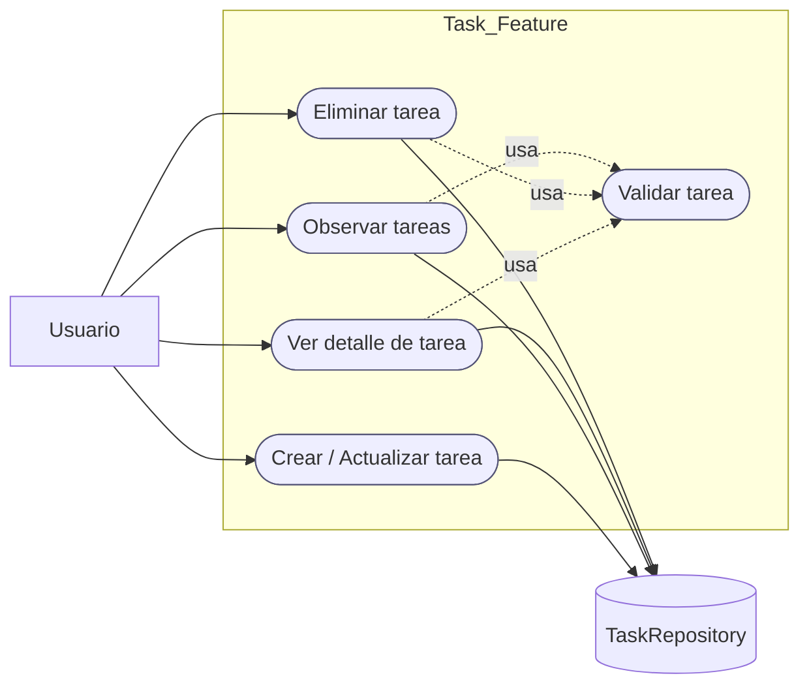

## Diagrama de casos de uso

```mermaid
flowchart LR
    %% Actor
    actor[Usuario]

    %% Sistema y casos de uso
    subgraph Task_Feature
      direction TB
      UC1([Crear / Actualizar tarea])
      UC2([Observar tareas])
      UC3([Ver detalle de tarea])
      UC4([Eliminar tarea])
      UC5([Validar tarea])
    end

    %% Repositorio (fuente de datos)
    repo[(TaskRepository)]

    %% Interacciones del actor
    actor --> UC1
    actor --> UC2
    actor --> UC3
    actor --> UC4

    %% Inclusiones/uso de validaciones
    UC3 -.->|usa| UC5
    UC4 -.->|usa| UC5
    UC2 -.->|usa| UC5

    %% Acceso a datos
    UC1 --> repo
    UC2 --> repo
    UC3 --> repo
    UC4 --> repo

    classDef ucClass fill:#eef,stroke:#557,stroke-width:1px
    UC1:::ucClass
    UC2:::ucClass
    UC3:::ucClass
    UC4:::ucClass
    UC5:::ucClass
```
