# 🧱 Arquitectura Offline-First con MVI, Room, Retrofit y Hilt WorkManager

Este documento describe cómo implementar una arquitectura Offline-First en una aplicación Android utilizando las siguientes tecnologías:

- **Room**: Para almacenamiento local de datos
- **Retrofit**: Para la comunicación con APIs REST
- **Hilt**: Para la inyección de dependencias
- **WorkManager**: Para la sincronización en segundo plano

## 📐 Diagrama de Arquitectura General


---

## 🔄 Flujo de Datos MVI

```mermaid
sequenceDiagram
    participant UI as UI (Compose)
    participant VM as ViewModel
    participant UC as UseCase
    participant Repo as Repository
    participant Room as Room DB
    participant API as Remote API
    participant WM as WorkManager

    Note over UI,WM: Crear Nueva Tarea (Offline-First)
    
    rect rgb(129, 212, 250, 0.2)
    Note right of UI: 🎯 Capa de UI
    UI->>VM: TaskEvent.CrearTask
    VM->>VM: _state.update(userMessage)
    VM-->>UI: TaskUiState updated
    end
    
    rect rgb(255, 245, 157, 0.2)
    Note right of UC: 🧠 Capa de Dominio
    VM->>UC: createTaskLocal()
    end
    
    rect rgb(128, 203, 196, 0.2)
    Note right of Repo: 🧩 Capa de Datos
    UC->>Repo: createTaskLocal()
    Repo->>Room: upsert(isPending=true)
    Room-->>Repo: Success
    Repo-->>UC: Resource.Success
    UC-->>VM: Success
    end
    
    rect rgb(179, 157, 219, 0.2)
    Note right of WM: 🔄 Sincronización
    VM->>WM: triggerSyncWorker()
    
    Note over WM,API: Sincronización en Segundo Plano
    
    WM->>Repo: postPendingTasks()
    Repo->>Room: getPendingCreateTasks()
    Room-->>Repo: List<TaskEntity>
    end
    
    rect rgb(255, 171, 145, 0.2)
    Note right of API: 🌐 Remote API
    Repo->>API: createTask()
    API-->>Repo: remoteId
    end
    
    rect rgb(197, 225, 165, 0.2)
    Note right of Room: ✅ Actualización
    Repo->>Room: upsert(isPending=false, remoteId)
    Room-->>UI: Flow actualizado
    end
```



---

## 🧩 Capa de Datos

### 🗃️ Room

```kotlin
@Entity(tableName = "tasks")
data class TaskEntity(
    @PrimaryKey val id: String = UUID.randomUUID().toString(),
    val remoteId: Int? = null,
    val descripcion: String,
    val tiempo: Int,
    val isPendingCreate: Boolean = false
)

@Dao
interface TaskDao {
    @Query("SELECT * FROM tasks") 
    fun observeTasks(): Flow<List<TaskEntity>>
    
    @Query("SELECT * FROM tasks WHERE id = :id") 
    suspend fun getTask(id: String): TaskEntity?
    
    @Upsert 
    suspend fun upsert(task: TaskEntity)
    
    @Query("DELETE FROM tasks WHERE id = :id") 
    suspend fun delete(id: String)
    
    @Query("SELECT * FROM tasks WHERE isPendingCreate = 1") 
    suspend fun getPendingCreateTasks(): List<TaskEntity>
}
```

---

### 🌐 Retrofit

```kotlin
data class TaskRequest(
    val descripcion: String,
    val tiempo: Int
)
data class TaskResponse(
    val tareaId: Int,
    val descripcion: String,
    val tiempo: Int
)

interface TaskApiService {
    @POST("api/tasks")
    suspend fun createTask(@Body request: TaskRequest): Response<TaskResponse>

    @PUT("api/tasks/{id}") 
    suspend fun updateTask(@Path("id") id: Int, @Body request: TaskRequest): Response<Unit>

    @DELETE("api/tasks/{id}") 
    suspend fun deleteTask(@Path("id") id: Int): Response<Unit>
}
```

### 🛰️ Remote Data Source

```kotlin
class TaskRemoteDataSource @Inject constructor(
    private val api: TaskApiService
) {
    suspend fun createTask(request: TaskRequest): Resource<TaskResponse> {
        return try {
            val response = api.createTask(request)
            if (response.isSuccessful) {
                response.body()?.let { Resource.Success(it) }
                    ?: Resource.Error("Respuesta vacía del servidor")
            } else {
                Resource.Error("HTTP ${response.code()} ${response.message()}")
            }
        } catch (e: Exception) {
            Resource.Error(e.localizedMessage ?: "Error de red")
        }
    }

    suspend fun updateTask(id: Int, request: TaskRequest): Resource<Unit> {
        return try {
            val response = api.updateTask(id, request)
            if (response.isSuccessful) {
                Resource.Success(Unit)
            } else {
                Resource.Error("HTTP ${response.code()} ${response.message()}")
            }
        } catch (e: Exception) {
            Resource.Error(e.localizedMessage ?: "Error de red")
        }
    }

    suspend fun deleteTask(id: Int): Resource<Unit> {
        return try {
            val response = api.deleteTask(id)
            if (response.isSuccessful) {
                Resource.Success(Unit)
            } else {
                Resource.Error("HTTP ${response.code()} ${response.message()}")
            }
        } catch (e: Exception) {
            Resource.Error(e.localizedMessage ?: "Error de red")
        }
    }
}
```

---

### 🔄 Repositorio (Implementación)

```kotlin
class TaskRepositoryImpl @Inject constructor(
    private val localDataSource: TaskDao,
    private val remoteDataSource: TaskRemoteDataSource
) : TaskRepository {
    override suspend fun createTaskLocal(task: Task): Resource<Task> {
        val pending = task.copy(isPendingCreate = true)
        localDataSource.upsert(pending)
        return Resource.Success(pending)
    }

    override suspend fun upsert(task: Task): Resource<Unit> {
        val remoteId = task.remoteId ?: return Resource.Error("No remoteId")
        val request = TaskRequest(task.descripcion, task.tiempo)
        return when (val result = remoteDataSource.updateTask(remoteId, request)) {
            is Resource.Success -> {
                localDataSource.upsert(task)
                Resource.Success(Unit)
            }
            is Resource.Error -> result
            else -> Resource.Loading()
        }
    }

    override suspend fun delete(id: String): Resource<Unit> {
        val task = localDataSource.getTask(id) ?: return Resource.Error("No encontrada")
        val remoteId = task.remoteId ?: return Resource.Error("No remoteId")
        return when (val result = remoteDataSource.deleteTask(remoteId)) {
            is Resource.Success -> {
                localDataSource.delete(id)
                Resource.Success(Unit)
            }
            is Resource.Error -> result
            else -> Resource.Loading()
        }
    }

    override suspend fun postPendingTasks(): Resource<Unit> {
        val pending = localDataSource.getPendingCreateTasks()
        for (task in pending) {
            val request = TaskRequest(task.descripcion, task.tiempo)
            when (val result = remoteDataSource.createTask(request)) {
                is Resource.Success -> {
                    val synced = task.copy(remoteId = result.data?.tareaId, isPendingCreate = false)
                    localDataSource.upsert(synced)
                }
                is Resource.Error -> return Resource.Error("Falló sincronización")
                else -> {}
            }
        }
        return Resource.Success(Unit)
    }
}
```

---

## 🎯 Capa de Dominio

### 📋 Modelo de Dominio

```kotlin
data class Task(
    val id: String = UUID.randomUUID().toString(),
    val remoteId: Int? = null,
    val descripcion: String,
    val tiempo: Int,
    val isPendingCreate: Boolean = false
)
```

### 🔌 Repositorio (Interfaz)

```kotlin
interface TaskRepository {
    fun observeTasks(): Flow<List<Task>>
    suspend fun getTask(id: String): Task?
    suspend fun createTaskLocal(task: Task): Resource<Task>
    suspend fun upsert(task: Task): Resource<Unit>
    suspend fun delete(id: String): Resource<Unit>
    suspend fun postPendingTasks(): Resource<Unit>
}
```

### 🧪 Use Cases

```kotlin
class CreateTaskLocalUseCase @Inject constructor(
    private val repo: TaskRepository
) {
    suspend operator fun invoke(task: Task): Resource<Task> = repo.createTaskLocal(task)
}

class UpsertTaskUseCase @Inject constructor(
    private val repo: TaskRepository
) {
    suspend operator fun invoke(task: Task): Resource<Unit> = repo.upsert(task)
}

class DeleteTaskUseCase @Inject constructor(
    private val repo: TaskRepository
) {
    suspend operator fun invoke(id: String): Resource<Unit> = repo.delete(id)
}

class TriggerSyncUseCase @Inject constructor(
    @ApplicationContext private val context: Context
) {
    operator fun invoke() {
        val request = OneTimeWorkRequestBuilder<SyncWorker>().build()
        WorkManager.getInstance(context).enqueue(request)
    }
}
```

---

## 🔄 Sincronización con WorkManager + Hilt

### 📊 Diagrama de Estados de Tarea

```mermaid
stateDiagram-v2
    [*] --> LocalPending: Usuario crea tarea
    
    LocalPending: Guardada Localmente
    LocalPending: isPendingCreate = true
    
    Syncing: Sincronizando
    Syncing: WorkManager en ejecución
    
    Synced: Sincronizada
    Synced: isPendingCreate = false
    Synced: remoteId != null
    
    Failed: Error de Sincronización
    Failed: Reintento programado
    
    LocalPending --> Syncing: WorkManager trigger
    Syncing --> Synced: API Success
    Syncing --> Failed: API Error
    Failed --> Syncing: Retry
    
    Synced --> [*]
    
    style LocalPending fill:#ffe082,stroke:#ffb300,stroke-width:2px,color:#212121
    style Syncing fill:#b39ddb,stroke:#7e57c2,stroke-width:2px,color:#212121
    style Synced fill:#c5e1a5,stroke:#558b2f,stroke-width:2px,color:#212121
    style Failed fill:#ef9a9a,stroke:#c62828,stroke-width:2px,color:#212121
    
    note right of LocalPending
        La tarea es visible
        inmediatamente en la UI
    end note
    
    note right of Synced
        Tarea persistida
        en el servidor
    end note
```



### 🔁 Flujo de Sincronización


### 1. 📦 Dependencias en `build.gradle.kts`

```kotlin
dependencies {
    implementation("androidx.hilt:hilt-work:1.0.0")
    ksp("androidx.hilt:hilt-compiler:1.0.0")
}
```

---

### 2. 🏗️ Worker con Hilt

```kotlin
@HiltWorker
class SyncWorker @AssistedInject constructor(
    @Assisted context: Context,
    @Assisted workerParams: WorkerParameters,
    private val taskRepository: TaskRepository
) : CoroutineWorker(context, workerParams) {

    override suspend fun doWork(): Result {
        return when (taskRepository.postPendingTasks()) {
            is Resource.Success -> Result.success()
            is Resource.Error -> Result.retry()
            else -> Result.failure()
        }
    }
}
```

---

### 3. 🧩 WorkerFactory personalizada

```kotlin
@Singleton
class MyWorkerFactory @Inject constructor(
    private val hiltWorkerFactory: HiltWorkerFactory
) : WorkerFactory() {

    override fun createWorker(
        appContext: Context,
        workerClassName: String,
        workerParameters: WorkerParameters
    ): ListenableWorker? {
        return hiltWorkerFactory.createWorker(appContext, workerClassName, workerParameters)
    }
}
```

---

### 4. 🏁 Inicialización en `Application`

```kotlin
@HiltAndroidApp
class MyApplication : Application(), Configuration.Provider {

    @Inject lateinit var workerFactory: MyWorkerFactory

    override fun getWorkManagerConfiguration(): Configuration {
        return Configuration.Builder()
            .setWorkerFactory(workerFactory)
            .build()
    }
}
```

---

### 5. 🚀 Disparar el Worker

```kotlin
fun triggerSyncWorker(context: Context) {
    val request = OneTimeWorkRequestBuilder<SyncWorker>().build()
    WorkManager.getInstance(context).enqueue(request)
}
```

---

## 🎯 Capa de Presentación

### 🎨 Patrón MVI - Flujo Unidireccional

```mermaid
graph LR
    subgraph "Compose UI"
        Screen[TaskListScreen]
        Body[TaskListBody]
    end
    
    subgraph "ViewModel"
        State[TaskUiState]
        Event[TaskEvent]
        Logic[Business Logic]
    end
    
    Body -->|"Interacción Usuario"| Event
    Event -->|"onEvent()"| Logic
    Logic -->|"_state.update()"| State
    State -->|"collectAsStateWithLifecycle()"| Body
    
    Logic -.->|"suspend fun"| UC[Use Cases]
    
    %% Estilos consistentes con el resto
    style Screen fill:#81d4fa,stroke:#0288d1,stroke-width:2px,color:#212121
    style Body fill:#81d4fa,stroke:#0288d1,stroke-width:2px,color:#212121
    style Event fill:#ffe082,stroke:#ffb300,stroke-width:2px,color:#212121
    style Logic fill:#81d4fa,stroke:#0288d1,stroke-width:2px,color:#212121
    style State fill:#c5e1a5,stroke:#558b2f,stroke-width:2px,color:#212121
    style UC fill:#fff59d,stroke:#f9a825,stroke-width:2px,color:#212121
```



### 📬 TaskEvent.kt

```kotlin
sealed interface TaskEvent {
    data class CrearTask(val descripcion: String) : TaskEvent
    data class UpdateTask(val task: Task) : TaskEvent
    data class DeleteTask(val id: String) : TaskEvent
    object ShowCreateSheet : TaskEvent
    object HideCreateSheet : TaskEvent
    data class OnDescriptionChange(val description: String) : TaskEvent
    object UserMessageShown : TaskEvent
}
```

### 📊 TaskUiState.kt

```kotlin
data class TaskUiState(
    val isLoading: Boolean = false,
    val tasks: List<Task> = emptyList(),
    val userMessage: String? = null,
    val showCreateSheet: Boolean = false,
    val taskDescription: String = ""
)
```

### 🎮 TaskViewModel.kt

```kotlin
@HiltViewModel
class TaskViewModel @Inject constructor(
    private val createTaskLocalUseCase: CreateTaskLocalUseCase,
    private val upsertTaskUseCase: UpsertTaskUseCase,
    private val deleteTaskUseCase: DeleteTaskUseCase,
    private val triggerSyncUseCase: TriggerSyncUseCase
) : ViewModel() {

    private val _state = MutableStateFlow(TaskUiState(isLoading = true))
    val state: StateFlow<TaskUiState> = _state.asStateFlow()

    fun onEvent(event: TaskEvent) {
        when (event) {
            is TaskEvent.CrearTask -> crearTask(event.descripcion)
            is TaskEvent.UpdateTask -> updateTask(event.task)
            is TaskEvent.DeleteTask -> deleteTask(event.id)
            is TaskEvent.ShowCreateSheet -> _state.update { it.copy(showCreateSheet = true) }
            is TaskEvent.HideCreateSheet -> _state.update { it.copy(showCreateSheet = false, taskDescription = "") }
            is TaskEvent.OnDescriptionChange -> _state.update { it.copy(taskDescription = event.description) }
            is TaskEvent.UserMessageShown -> clearMessage()
        }
    }

    private fun crearTask(desc: String) = viewModelScope.launch {
        val task = Task(descripcion = desc, tiempo = 0)
        when (val result = createTaskLocalUseCase(task)) {
            is Resource.Success -> {
                _state.update { it.copy(userMessage = "Tarea guardada localmente", showCreateSheet = false, taskDescription = "") }
                triggerSyncUseCase()
            }
            is Resource.Error -> _state.update { it.copy(userMessage = result.message) }
            else -> {}
        }
    }

    private fun updateTask(task: Task) = viewModelScope.launch {
        when (val result = upsertTaskUseCase(task)) {
            is Resource.Success -> _state.update { it.copy(userMessage = "Tarea actualizada") }
            is Resource.Error -> _state.update { it.copy(userMessage = result.message) }
            else -> {}
        }
    }

    private fun deleteTask(id: String) = viewModelScope.launch {
        when (val result = deleteTaskUseCase(id)) {
            is Resource.Success -> _state.update { it.copy(userMessage = "Tarea eliminada") }
            is Resource.Error -> _state.update { it.copy(userMessage = result.message) }
            else -> {}
        }
    }

    private fun clearMessage() {
        _state.update { it.copy(userMessage = null) }
    }
}
```

### 📱 TaskListScreen.kt

```kotlin
@Composable
fun TaskListScreen(
    viewModel: TaskViewModel = hiltViewModel()
) {
    val state by viewModel.state.collectAsStateWithLifecycle()
    TaskListBody(state, viewModel::onEvent)
}

@OptIn(ExperimentalMaterial3Api::class)
@Composable
fun TaskListBody(
    state: TaskUiState,
    onEvent: (TaskEvent) -> Unit
) {
    val sheetState = rememberModalBottomSheetState()
    val snackbarHostState = remember { SnackbarHostState() }

    LaunchedEffect(state.userMessage) {
        state.userMessage?.let { message ->
            snackbarHostState.showSnackbar(message)
            onEvent(TaskEvent.UserMessageShown)
        }
    }

    Scaffold(
        snackbarHost = { SnackbarHost(snackbarHostState) },
        floatingActionButton = {
            FloatingActionButton(
                onClick = { onEvent(TaskEvent.ShowCreateSheet) },
                modifier = Modifier.testTag("fab_add")
            ) {
                Icon(
                    imageVector = Icons.Default.Add,
                    contentDescription = "Agregar tarea"
                )
            }
        }
    ) { padding ->
        Box(
            modifier = Modifier
                .padding(padding)
                .fillMaxSize()
        ) {
            if (state.isLoading) {
                CircularProgressIndicator(
                    modifier = Modifier
                        .align(Alignment.Center)
                        .testTag("loading")
                )
            } else {
                if (state.tasks.isEmpty()) {
                    Text(
                        text = "No hay tareas",
                        modifier = Modifier
                            .align(Alignment.Center)
                            .testTag("empty_message"),
                        style = MaterialTheme.typography.bodyLarge
                    )
                } else {
                    LazyColumn(
                        modifier = Modifier.fillMaxSize(),
                        contentPadding = PaddingValues(16.dp),
                        verticalArrangement = Arrangement.spacedBy(8.dp)
                    ) {
                        items(
                            items = state.tasks,
                            key = { it.id }
                        ) { task ->
                            TaskItem(
                                task = task,
                                onDelete = {
                                    onEvent(TaskEvent.DeleteTask(task.id))
                                }
                            )
                        }
                    }
                }
            }
        }

        if (state.showCreateSheet) {
            ModalBottomSheet(
                onDismissRequest = { onEvent(TaskEvent.HideCreateSheet) },
                sheetState = sheetState
            ) {
                Column(
                    modifier = Modifier
                        .fillMaxWidth()
                        .padding(16.dp)
                        .navigationBarsPadding()
                        .imePadding(),
                    verticalArrangement = Arrangement.spacedBy(16.dp)
                ) {
                    Text(
                        text = "Nueva Tarea",
                        style = MaterialTheme.typography.headlineSmall
                    )

                    OutlinedTextField(
                        value = state.taskDescription,
                        onValueChange = { onEvent(TaskEvent.OnDescriptionChange(it)) },
                        label = { Text("Descripción") },
                        modifier = Modifier
                            .fillMaxWidth()
                            .testTag("input_description"),
                        singleLine = false,
                        minLines = 3,
                        maxLines = 5
                    )

                    Row(
                        modifier = Modifier.fillMaxWidth(),
                        horizontalArrangement = Arrangement.spacedBy(8.dp)
                    ) {
                        OutlinedButton(
                            onClick = { onEvent(TaskEvent.HideCreateSheet) },
                            modifier = Modifier.weight(1f)
                        ) {
                            Text("Cancelar")
                        }

                        Button(
                            onClick = {
                                if (state.taskDescription.isNotBlank()) {
                                    onEvent(TaskEvent.CrearTask(state.taskDescription))
                                }
                            },
                            modifier = Modifier
                                .weight(1f)
                                .testTag("btn_save"),
                            enabled = state.taskDescription.isNotBlank()
                        ) {
                            Text("Guardar")
                        }
                    }
                }
            }
        }
    }
}

@Composable
fun TaskItem(
    task: Task,
    onDelete: () -> Unit
) {
    ElevatedCard(
        modifier = Modifier
            .fillMaxWidth()
            .testTag("task_item_${task.id}")
    ) {
        Row(
            modifier = Modifier
                .fillMaxWidth()
                .padding(16.dp),
            verticalAlignment = Alignment.CenterVertically
        ) {
            Column(
                modifier = Modifier.weight(1f)
            ) {
                Text(
                    text = task.descripcion,
                    style = MaterialTheme.typography.bodyLarge
                )

                Text(
                    text = "${task.tiempo} min",
                    style = MaterialTheme.typography.bodyMedium,
                    color = MaterialTheme.colorScheme.primary
                )

                if (task.isPendingCreate) {
                    Text(
                        text = "Pendiente de sincronizar",
                        style = MaterialTheme.typography.bodySmall,
                        color = MaterialTheme.colorScheme.secondary
                    )
                }
            }

            IconButton(
                onClick = onDelete,
                modifier = Modifier.testTag("btn_delete_${task.id}")
            ) {
                Icon(
                    imageVector = Icons.Default.Delete,
                    contentDescription = "Eliminar tarea"
                )
            }
        }
    }
}

@Preview(showBackground = true)
@Composable
private fun TaskListBodyPreview() {
    MaterialTheme {
        val state = TaskUiState(
            isLoading = false,
            tasks = listOf(
                Task(
                    id = "1",
                    descripcion = "Tarea urgente",
                    tiempo = 30,
                    isPendingCreate = false
                ),
                Task(
                    id = "2",
                    descripcion = "Tarea pendiente de sincronizar",
                    tiempo = 45,
                    isPendingCreate = true
                ),
                Task(
                    id = "3",
                    descripcion = "Tarea normal",
                    tiempo = 60,
                    isPendingCreate = false
                )
            )
        )
        TaskListBody(state) {}
    }
}
```

---

## 🧪 Testing

### 📦 Dependencias de Testing

```kotlin
dependencies {
    // Unit Testing
    testImplementation("junit:junit:4.13.2")
    testImplementation("org.jetbrains.kotlinx:kotlinx-coroutines-test:1.7.3")
    testImplementation("io.mockk:mockk:1.13.8")
    testImplementation("androidx.arch.core:core-testing:2.2.0")
    
    // Android Instrumented Testing"
    androidTestImplementation("androidx.test.ext:junit:1.1.5")
    androidTestImplementation("androidx.test.espresso:espresso-core:3.5.1")
    
    // Compose Testing
    androidTestImplementation("androidx.compose.ui:ui-test-junit4:1.5.4")
    debugImplementation("androidx.compose.ui:ui-test-manifest:1.5.4")
    
    // Hilt Testing
    testImplementation("com.google.dagger:hilt-android-testing:2.48")
    kspTest("com.google.dagger:hilt-android-compiler:2.48")
    androidTestImplementation("com.google.dagger:hilt-android-testing:2.48")
    kspAndroidTest("com.google.dagger:hilt-android-compiler:2.48")
}
```
---
### 🧩 Tests de Capa de Datos

#### TaskRepositoryImplTest.kt

```kotlin
@ExperimentalCoroutinesApi
class TaskRepositoryImplTest {

    @get:Rule
    val instantExecutorRule = InstantTaskExecutorRule()

    private lateinit var repository: TaskRepositoryImpl
    private lateinit var localDataSource: TaskDao
    private lateinit var remoteDataSource: TaskRemoteDataSource

    @Before
    fun setup() {
        localDataSource = mockk(relaxed = true)
        remoteDataSource = mockk(relaxed = true)
        repository = TaskRepositoryImpl(localDataSource, remoteDataSource)
    }

    @Test
    fun `createTaskLocal guarda tarea con isPendingCreate true`() = runTest {
        // Given
        val task = Task(
            id = "1",
            descripcion = "Nueva tarea",
            tiempo = 30
        )
        val taskSlot = slot<TaskEntity>()
        coEvery { localDataSource.upsert(capture(taskSlot)) } just Runs

        // When
        val result = repository.createTaskLocal(task)

        // Then
        assertTrue(result is Resource.Success)
        coVerify { localDataSource.upsert(any()) }
        assertTrue(taskSlot.captured.isPendingCreate)
    }

    @Test
    fun `postPendingTasks sincroniza tareas pendientes correctamente`() = runTest {
        // Given
        val pendingTask = TaskEntity(
            id = "1",
            descripcion = "Tarea pendiente",
            tiempo = 30,
            isPendingCreate = true
        )
        val response = TaskResponse(tareaId = 100, descripcion = "Tarea pendiente", tiempo = 30)
        
        coEvery { localDataSource.getPendingCreateTasks() } returns listOf(pendingTask)
        coEvery { remoteDataSource.createTask(any()) } returns Resource.Success(response)
        coEvery { localDataSource.upsert(any()) } just Runs

        // When
        val result = repository.postPendingTasks()

        // Then
        assertTrue(result is Resource.Success)
        coVerify { remoteDataSource.createTask(any()) }
        coVerify { 
            localDataSource.upsert(
                match { it.remoteId == 100 && !it.isPendingCreate }
            ) 
        }
    }

    @Test
    fun `delete retorna error cuando no existe remoteId`() = runTest {
        // Given
        val task = TaskEntity(
            id = "1",
            remoteId = null,
            descripcion = "Tarea sin sync",
            tiempo = 45
        )
        coEvery { localDataSource.getTask("1") } returns task

        // When
        val result = repository.delete("1")

        // Then
        assertTrue(result is Resource.Error)
        assertEquals("No remoteId", (result as Resource.Error).message)
        coVerify(exactly = 0) { remoteDataSource.deleteTask(any()) }
    }
}
```

#### TaskRemoteDataSourceTest.kt

```kotlin
class TaskRemoteDataSourceTest {

    private lateinit var dataSource: TaskRemoteDataSource
    private lateinit var api: TaskApiService

    @Before
    fun setup() {
        api = mockk()
        dataSource = TaskRemoteDataSource(api)
    }

    @Test
    fun `createTask retorna Success cuando API responde 200`() = runTest {
        // Given
        val request = TaskRequest("Nueva tarea", 30)
        val response = TaskResponse(1, "Nueva tarea", 30)
        coEvery { api.createTask(request) } returns Response.success(response)

        // When
        val result = dataSource.createTask(request)

        // Then
        assertTrue(result is Resource.Success)
        assertEquals(response, (result as Resource.Success).data)
    }

    @Test
    fun `createTask retorna Error cuando API falla`() = runTest {
        // Given
        val request = TaskRequest("Nueva tarea", 30)
        coEvery { api.createTask(request) } returns Response.error(
            500,
            "Server Error".toResponseBody("text/plain".toMediaTypeOrNull())
        )

        // When
        val result = dataSource.createTask(request)

        // Then
        assertTrue(result is Resource.Error)
        assertTrue((result as Resource.Error).message!!.contains("HTTP 500"))
    }

    @Test
    fun `createTask retorna Error cuando hay excepción de red`() = runTest {
        // Given
        val request = TaskRequest("Nueva tarea", 30)
        coEvery { api.createTask(request) } throws IOException("Network error")

        // When
        val result = dataSource.createTask(request)

        // Then
        assertTrue(result is Resource.Error)
        assertEquals("Network error", (result as Resource.Error).message)
    }
}
```

---

### 🎯 Tests de Capa de Dominio

#### CreateTaskLocalUseCaseTest.kt

```kotlin
@ExperimentalCoroutinesApi
class CreateTaskLocalUseCaseTest {

    private lateinit var useCase: CreateTaskLocalUseCase
    private lateinit var repository: TaskRepository

    @Before
    fun setup() {
        repository = mockk()
        useCase = CreateTaskLocalUseCase(repository)
    }

    @Test
    fun `invoke llama al repositorio correctamente`() = runTest {
        // Given
        val task = Task(descripcion = "Test task", tiempo = 30)
        coEvery { repository.createTaskLocal(task) } returns Resource.Success(task)

        // When
        val result = useCase(task)

        // Then
        assertTrue(result is Resource.Success)
        assertEquals(task, (result as Resource.Success).data)
        coVerify { repository.createTaskLocal(task) }
    }

    @Test
    fun `invoke propaga errores del repositorio`() = runTest {
        // Given
        val task = Task(descripcion = "Test task", tiempo = 30)
        val errorMessage = "Database error"
        coEvery { repository.createTaskLocal(task) } returns Resource.Error(errorMessage)

        // When
        val result = useCase(task)

        // Then
        assertTrue(result is Resource.Error)
        assertEquals(errorMessage, (result as Resource.Error).message)
    }
}
```

#### DeleteTaskUseCaseTest.kt

```kotlin
@ExperimentalCoroutinesApi
class DeleteTaskUseCaseTest {

    private lateinit var useCase: DeleteTaskUseCase
    private lateinit var repository: TaskRepository

    @Before
    fun setup() {
        repository = mockk()
        useCase = DeleteTaskUseCase(repository)
    }

    @Test
    fun `invoke elimina tarea exitosamente`() = runTest {
        // Given
        val taskId = "task-123"
        coEvery { repository.delete(taskId) } returns Resource.Success(Unit)

        // When
        val result = useCase(taskId)

        // Then
        assertTrue(result is Resource.Success)
        coVerify { repository.delete(taskId) }
    }

    @Test
    fun `invoke retorna error cuando la tarea no existe`() = runTest {
        // Given
        val taskId = "non-existent"
        coEvery { repository.delete(taskId) } returns Resource.Error("No encontrada")

        // When
        val result = useCase(taskId)

        // Then
        assertTrue(result is Resource.Error)
        assertEquals("No encontrada", (result as Resource.Error).message)
    }
}
```

---

### 🎨 Tests de Capa de Presentación

#### TaskViewModelTest.kt

```kotlin
@ExperimentalCoroutinesApi
class TaskViewModelTest {

    @get:Rule
    val instantExecutorRule = InstantTaskExecutorRule()

    @get:Rule
    val mainDispatcherRule = MainDispatcherRule()

    private lateinit var viewModel: TaskViewModel
    private lateinit var createTaskUseCase: CreateTaskLocalUseCase
    private lateinit var upsertTaskUseCase: UpsertTaskUseCase
    private lateinit var deleteTaskUseCase: DeleteTaskUseCase
    private lateinit var application: Application

    @Before
    fun setup() {
        createTaskUseCase = mockk()
        upsertTaskUseCase = mockk()
        deleteTaskUseCase = mockk()
        application = mockk(relaxed = true)
        
        viewModel = TaskViewModel(
            createTaskUseCase,
            upsertTaskUseCase,
            deleteTaskUseCase,
            application
        )
    }

    @Test
    fun `onEvent ShowCreateSheet actualiza estado correctamente`() {
        // When
        viewModel.onEvent(TaskEvent.ShowCreateSheet)

        // Then
        assertTrue(viewModel.state.value.showCreateSheet)
    }

    @Test
    fun `onEvent HideCreateSheet limpia descripción y cierra sheet`() {
        // Given
        viewModel.onEvent(TaskEvent.ShowCreateSheet)
        viewModel.onEvent(TaskEvent.OnDescriptionChange("Test"))

        // When
        viewModel.onEvent(TaskEvent.HideCreateSheet)

        // Then
        assertFalse(viewModel.state.value.showCreateSheet)
        assertEquals("", viewModel.state.value.taskDescription)
    }

    @Test
    fun `onEvent CrearTask crea tarea y cierra sheet cuando es exitoso`() = runTest {
        // Given
        val descripcion = "Nueva tarea"
        val task = Task(descripcion = descripcion, tiempo = 0)
        coEvery { createTaskUseCase(any()) } returns Resource.Success(task)

        // When
        viewModel.onEvent(TaskEvent.CrearTask(descripcion))
        advanceUntilIdle()

        // Then
        assertFalse(viewModel.state.value.showCreateSheet)
        assertEquals("", viewModel.state.value.taskDescription)
        assertEquals("Tarea guardada localmente", viewModel.state.value.userMessage)
        coVerify { createTaskUseCase(any()) }
    }

    @Test
    fun `onEvent CrearTask muestra error cuando falla`() = runTest {
        // Given
        val descripcion = "Nueva tarea"
        val errorMessage = "Error de base de datos"
        coEvery { createTaskUseCase(any()) } returns Resource.Error(errorMessage)

        // When
        viewModel.onEvent(TaskEvent.CrearTask(descripcion))
        advanceUntilIdle()

        // Then
        assertEquals(errorMessage, viewModel.state.value.userMessage)
    }

    @Test
    fun `onEvent UpdateTask actualiza tarea correctamente`() = runTest {
        // Given
        val task = Task(id = "1", descripcion = "Test", tiempo = 30)
        coEvery { upsertTaskUseCase(task) } returns Resource.Success(Unit)

        // When
        viewModel.onEvent(TaskEvent.UpdateTask(task))
        advanceUntilIdle()

        // Then
        assertEquals("Tarea actualizada", viewModel.state.value.userMessage)
        coVerify { upsertTaskUseCase(task) }
    }

    @Test
    fun `onEvent DeleteTask elimina tarea correctamente`() = runTest {
        // Given
        val taskId = "task-123"
        coEvery { deleteTaskUseCase(taskId) } returns Resource.Success(Unit)

        // When
        viewModel.onEvent(TaskEvent.DeleteTask(taskId))
        advanceUntilIdle()

        // Then
        assertEquals("Tarea eliminada", viewModel.state.value.userMessage)
        coVerify { deleteTaskUseCase(taskId) }
    }

    @Test
    fun `onEvent UserMessageShown limpia mensaje`() {
        // Given - Estado con mensaje
        viewModel.onEvent(TaskEvent.ShowCreateSheet)

        // When
        viewModel.onEvent(TaskEvent.UserMessageShown)

        // Then
        assertNull(viewModel.state.value.userMessage)
    }

    @Test
    fun `estado inicial tiene isLoading true`() {
        // Then
        assertTrue(viewModel.state.value.isLoading)
        assertTrue(viewModel.state.value.tasks.isEmpty())
    }
}

// Regla para el Dispatcher Main en tests
@ExperimentalCoroutinesApi
class MainDispatcherRule(
    private val testDispatcher: TestDispatcher = UnconfinedTestDispatcher()
) : TestWatcher() {
    override fun starting(description: Description) {
        Dispatchers.setMain(testDispatcher)
    }

    override fun finished(description: Description) {
        Dispatchers.resetMain()
    }
}
```

#### TaskListScreenTest.kt (UI Test con Compose)

```kotlin
@ExperimentalMaterial3Api
class TaskListScreenTest {

    @get:Rule
    val composeTestRule = createComposeRule()

    @Test
    fun taskListBody_muestra_loading_cuando_isLoading_es_true() {
        // Given
        val state = TaskUiState(isLoading = true)

        // When
        composeTestRule.setContent {
            MaterialTheme {
                TaskListBody(state = state, onEvent = {})
            }
        }

        // Then
        composeTestRule.onNodeWithTag("loading").assertIsDisplayed()
    }

    @Test
    fun taskListBody_muestra_mensaje_vacio_cuando_no_hay_tareas() {
        // Given
        val state = TaskUiState(isLoading = false, tasks = emptyList())

        // When
        composeTestRule.setContent {
            MaterialTheme {
                TaskListBody(state = state, onEvent = {})
            }
        }

        // Then
        composeTestRule.onNodeWithTag("empty_message").assertIsDisplayed()
        composeTestRule.onNodeWithText("No hay tareas").assertIsDisplayed()
    }

    @Test
    fun taskListBody_muestra_lista_de_tareas() {
        // Given
        val tasks = listOf(
            Task(id = "1", descripcion = "Tarea 1", tiempo = 30),
            Task(id = "2", descripcion = "Tarea 2", tiempo = 45)
        )
        val state = TaskUiState(isLoading = false, tasks = tasks)

        // When
        composeTestRule.setContent {
            MaterialTheme {
                TaskListBody(state = state, onEvent = {})
            }
        }

        // Then
        composeTestRule.onNodeWithText("Tarea 1").assertIsDisplayed()
        composeTestRule.onNodeWithText("Tarea 2").assertIsDisplayed()
    }

    @Test
    fun fab_dispara_evento_ShowCreateSheet() {
        // Given
        val state = TaskUiState(isLoading = false)
        var eventReceived: TaskEvent? = null

        // When
        composeTestRule.setContent {
            MaterialTheme {
                TaskListBody(
                    state = state,
                    onEvent = { eventReceived = it }
                )
            }
        }
        composeTestRule.onNodeWithTag("fab_add").performClick()

        // Then
        assertTrue(eventReceived is TaskEvent.ShowCreateSheet)
    }

    @Test
    fun boton_eliminar_dispara_evento_DeleteTask() {
        // Given
        val task = Task(id = "1", descripcion = "Test", tiempo = 30)
        val state = TaskUiState(isLoading = false, tasks = listOf(task))
        var eventReceived: TaskEvent? = null

        // When
        composeTestRule.setContent {
            MaterialTheme {
                TaskListBody(
                    state = state,
                    onEvent = { eventReceived = it }
                )
            }
        }
        composeTestRule.onNodeWithTag("btn_delete_1").performClick()

        // Then
        assertTrue(eventReceived is TaskEvent.DeleteTask)
        assertEquals("1", (eventReceived as TaskEvent.DeleteTask).id)
    }

    @Test
    fun bottomSheet_muestra_y_permite_escribir_descripcion() {
        // Given
        val state = TaskUiState(
            isLoading = false,
            showCreateSheet = true,
            taskDescription = ""
        )
        var lastDescription = ""

        // When
        composeTestRule.setContent {
            MaterialTheme {
                TaskListBody(
                    state = state,
                    onEvent = { 
                        if (it is TaskEvent.OnDescriptionChange) {
                            lastDescription = it.description
                        }
                    }
                )
            }
        }
        
        composeTestRule.onNodeWithTag("input_description")
            .performTextInput("Nueva tarea de prueba")

        // Then
        assertEquals("Nueva tarea de prueba", lastDescription)
    }

    @Test
    fun boton_guardar_esta_deshabilitado_cuando_descripcion_esta_vacia() {
        // Given
        val state = TaskUiState(
            isLoading = false,
            showCreateSheet = true,
            taskDescription = ""
        )

        // When
        composeTestRule.setContent {
            MaterialTheme {
                TaskListBody(state = state, onEvent = {})
            }
        }

        // Then
        composeTestRule.onNodeWithTag("btn_save").assertIsNotEnabled()
    }

    @Test
    fun tarea_pendiente_muestra_indicador_de_sincronizacion() {
        // Given
        val task = Task(
            id = "1",
            descripcion = "Tarea pendiente",
            tiempo = 30,
            isPendingCreate = true
        )
        val state = TaskUiState(isLoading = false, tasks = listOf(task))

        // When
        composeTestRule.setContent {
            MaterialTheme {
                TaskListBody(state = state, onEvent = {})
            }
        }

        // Then
        composeTestRule.onNodeWithText("Pendiente de sincronizar").assertIsDisplayed()
    }
}
```
